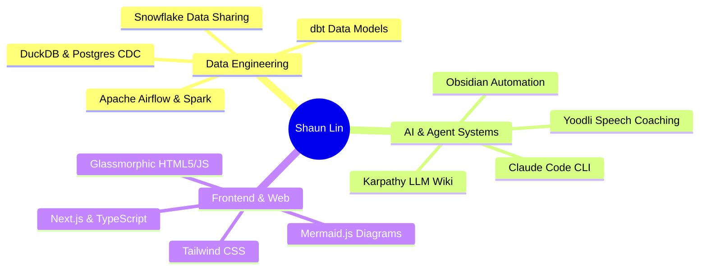

# 🚀 Shaun Lin — Data Engineer & AI Systems Architect

> **Master of Science in Analytics (Georgia Tech)** | Specializing in Snowflake Data Engineering, Large-Scale ETL Pipelines, Cloud Architecture, and AI Agent Workflows.

[](https://shaundataananalytics.github.io)
[](#-education--background)
[](#-technical-skills)

---

## 💡 Core Philosophy & Engineering Expertise

* **Cloud Data Warehousing & Integration**: End-to-end Snowflake data share environments, zero-copy clones, access control policies, dbt data modeling, and custom SQL views/stored procedures.
* **Data Pipeline Orchestration & Observability**: Building resilient batch and CDC streaming pipelines with Apache Airflow, Apache Spark, DuckDB, S3, and SFTP feeds with automated monitoring/alerting.
* **AI Agent & Knowledge Systems**: Pioneering Karpathy 3-Layer LLM Wiki architectures, Claude Code CLI workflows, Yoodli active recall coaching, and Obsidian second brain automation.
* **Interactive Tooling & Glassmorphic UI**: Building interactive HTML5/JS visualizers, DataviewJS dashboards, and focus intention protocols.

---

## 🛠️ Featured Systems & Visualizers

| System / Visualizer | Focus & Architecture | Live Preview |
| :--- | :--- | :--- |
| **🌐 Browser Intention Gate** | Focus protocol gater tracking session intent & time boundaries. | Interactive Obsidian Control Panel |
| **📊 SQL CTE Execution Visualizer** | Step-by-step CTE data pipelines & recursive hierarchy expansion tree. | Interactive HTML Engine |
| **🐍 Python Skill Tree & RPG Hub** | 4-tier RPG leveling system for memory models, scope, & data structures. | Web Audio + LocalStorage Dashboard |
| **📰 Live RSS Content Curator** | Real-time RSS aggregator with 1-click Markdown web clipping. | Glassmorphic RSS Engine |

---

## 🎓 Education & Background

* **Master of Science in Analytics** — *Georgia Institute of Technology* (Georgia Tech)
  * Specialization: Advanced Data Engineering, High-Performance Computing, and Machine Learning Systems.

---

## 💻 Technical Skills Matrix



---

## 🚀 Local Development & Deployment

```bash
# Clone repository
git clone https://github.com/ShaunDataAnalytics/ShaunDataAnalytics.github.io.git

# Install dependencies & run local dev server
npm install
npm run dev

# Build production static bundle
npm run build
```

The site is automatically built and deployed to GitHub Pages via **GitHub Actions** on every push to the `main` branch.

---

## 📬 Connect

* **Portfolio**: [https://shaundataananalytics.github.io](https://shaundataananalytics.github.io)
* **GitHub**: [@ShaunDataAnalytics](https://github.com/ShaunDataAnalytics)
