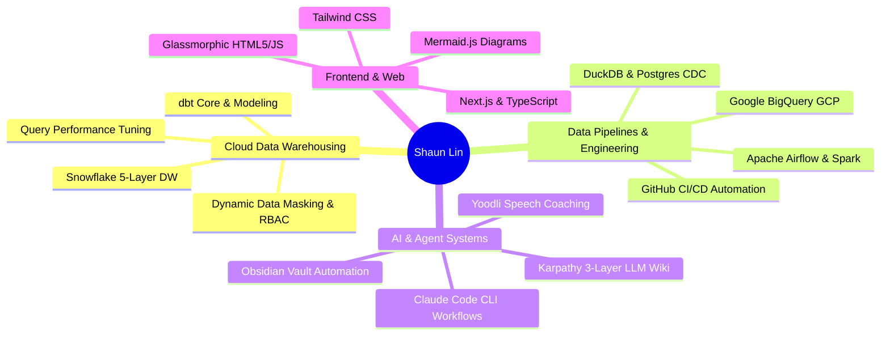

# 🚀 Shaun Lin — Senior Data Analytics Engineer & AI Systems Specialist

> **Master of Science in Analytics (Georgia Tech)** | Ex-Data Analytics Engineer at **American Student Assistance** | Specializing in Snowflake Data Warehousing, dbt Modeling, Data Pipeline Observability, & AI Agent Workflows.

[](https://shaundataanalytics.github.io)
[](#-education)
[](#-technical-skills-matrix)

---

## 💼 Work Experience & Core Achievements

### 📍 Data Analytics Engineer — *American Student Assistance (ASA)*
* **Data Warehouse Modernization**: Led the migration of legacy data platforms into a 5-layered Snowflake data warehouse architecture (`ODS`, `DS`, `STG`, `DWH`, `RPT`).
* **dbt & Performance Optimization**: Built version-controlled **dbt Core** models, custom test suites, and materialization strategies, **slashing core dashboard runtimes from 8–10 minutes down to <15 seconds**.
* **Data Security & Governance**: Researched and deployed Snowflake dynamic column-level masking policies and Role-Based Access Controls (RBAC) to protect millions of student PII records.

### 📍 Data Engineering & Validation Specialist — *Kafene*
* **Pipeline Reliability**: Designed Python and SQL automated validation testing frameworks integrated directly into GitHub CI/CD pipelines, **eliminating 90% of transactional schema drift and ingestion errors**.

### 📍 Associate Director, Data Insights — *NAAAP Boston (Volunteer)*
* **End-to-End Data Stack**: Built the analytics engineering team from scratch and architected a modern cloud data stack leveraging **Apache Airflow, Google BigQuery (GCP), and dbt**, cutting manual processing by **50%**.

---

## 🎓 Education

* **Master of Science in Analytics** — *Georgia Institute of Technology (Georgia Tech)*
  * Focus: Advanced Data Engineering, Analytical Databases, Machine Learning Systems, and Distributed Computing.

---

## 🔬 Featured Engineering & Analytics Projects

| Project / Repository | Key Technologies | Highlights |
| :--- | :--- | :--- |
| 📊 **[Housing Price Prediction Engine](https://github.com/ShaunDataAnalytics/Housing-price-Prediction)** | `Python`, `Scikit-Learn`, `Pandas` | Feature engineering, regression modeling, and price forecasting pipeline. |
| 🍿 **[TMDB Movie Analytics & EDA](https://github.com/ShaunDataAnalytics/TMDB-Dataset)** | `Python`, `EDA`, `Matplotlib`, `Seaborn` | Exploratory data analysis, box office revenue trends, and metric correlations. |
| 📚 **[Book Recommender System](https://github.com/ShaunDataAnalytics/CapstoneP-Book-Recommender)** | `Python`, `Collaborative Filtering` | Machine learning recommendation engine based on user preference vectors. |
| 🎓 **[Per Scholas Coursework](https://github.com/ShaunDataAnalytics/per-scholas-coursework)** | `SQL`, `Python`, `venv`, `MySQL` | Consolidated data engineering coursework, ERD schemas, and virtual environments. |

---

## 🛠️ Interactive Focus Tools & Visualizers

| System / Visualizer | Tech Stack | Highlights |
| :--- | :--- | :--- |
| **🌐 Browser Intention Gate** | JS, Glassmorphic UI, LocalStorage | Focus protocol gater tracking session intent & time boundaries. |
| **📊 SQL CTE Execution Visualizer** | HTML5, Mermaid.js, Fira Code | Step-by-step CTE execution engine & recursive hierarchy tree. |
| **🐍 Python Skill Tree & RPG Hub** | Web Audio API, JS, CSS3 | Gamified 4-tier skill tree for memory models & scope rules. |
| **📰 Live RSS Content Curator** | RSS2JSON API, Async JS | Live news & tech article aggregator for 0-Grasp inbox. |

---

## 💻 Technical Skills Matrix



---

## 🚀 Local Development & Build

```bash
# Clone repository
git clone https://github.com/ShaunDataAnalytics/ShaunDataAnalytics.github.io.git

# Install dependencies & run local dev server
npm install
npm run dev

# Build production static bundle
npm run build
```

The site is automatically built and deployed to GitHub Pages via **GitHub Actions** on every push to the `main` branch.

---

## 📬 Connect

* **Portfolio**: [https://shaundataanalytics.github.io](https://shaundataanalytics.github.io)
* **GitHub**: [@ShaunDataAnalytics](https://github.com/ShaunDataAnalytics)
